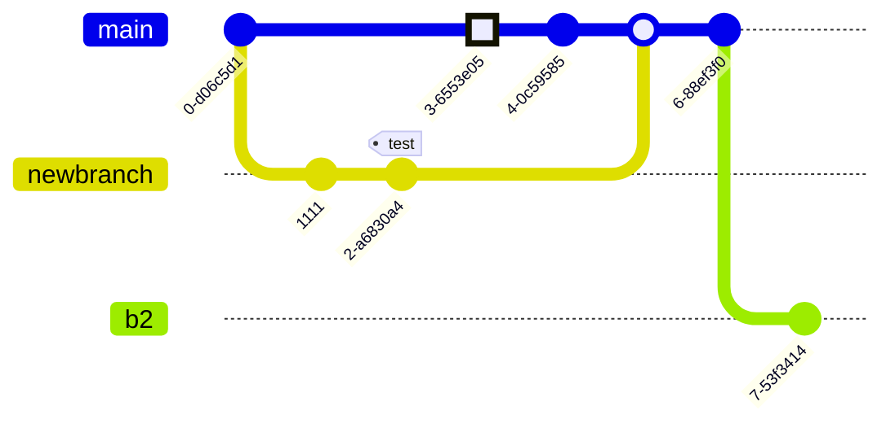

<!---
jakinyang/jakinyang is a ✨ special ✨ repository because its `README.md` (this file) appears on your GitHub profile.
You can click the Preview link to take a look at your changes.
--->

  

  
  
  
  

<h1 align="center">
  
  oh hello
  
</h1>
<!-- 

  

 -->

---

### 🧑🏻‍💻 About Me

> I used to defuse 💣 landmines 💣 ...
>
> Now I defuse 🪲 buggy code 🪲

- 🧨 I’m currently working on a run tracker/fitness app!
- 🔥 Always looking to do more Music, Cooking, and Tree Planting
- 🌱 Recently, I've been learning GraphQL, Swift, Firebase, and OSSU
- 🫱🏻‍🫲🏽 I want to try porting web apps effectively to mobile! (Do you want to make your app small?)
- ⚡️ Fun Fact: I used to be a landmine technician!

---

### 🛠 Languages and Tools :

<table width="320px">
    <tbody>
        <tr valign="top">
            <td width="80px" align="center">
            <strong>Python</strong> 
            
            </td>
            <td width="80px" align="center">
            <strong>Java</strong> 
            
            </td>
            <td width="80px" align="center">
            <strong>HTML</strong> 
            
            </td>
            <td width="80px" align="center">
            <strong>CSS</strong> 
            
            </td>
        </tr>
        <tr valign="top">
            <td width="80px" align="center">
            <strong>React</strong> 
            
            </td>
            <td width="80px" align="center">
            <strong>git</strong> 
            
            </td>
            <td width="80px" align="center">
            <strong>GitHub</strong> 
            
            <td width="80px" align="center">
            <strong>Canva</strong> 
            
            </td>
        </tr>
    </tbody>
</table>

