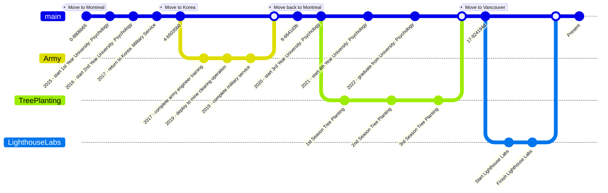

<!---
jakinyang/jakinyang is a ✨ special ✨ repository because its `README.md` (this file) appears on your GitHub profile.
You can click the Preview link to take a look at your changes.
--->

  

  
  
  
  

<!-- 

  

 -->

---

# 🧑🏻‍💻 About Me

> ### I used to defuse 💣 landmines 💣 ... Now I defuse 🪲 buggy code 🪲

### - 🧨 I’m currently working on a run tracker/fitness app!
### - 🔥 Always looking to do more Music, Cooking, and Tree Planting
### - 🌱 Recently, I've been learning GraphQL, Swift, Firebase, and OSSU
### - 🫱🏻‍🫲🏽 I want to try porting web apps effectively to mobile! 
### - ⚡️ Fun Fact: I used to be a landmine technician!

---

# 📈 Stats:

 
  

 

# 🛠 Languages and Tools :

<table>  
  <tr>
    <td>Languages</td>
    <td align="center" height="108" width="108">
      
       <strong>HTML</strong>
    </td>
    <td align="center" height="108" width="108">
      
       <strong>JavaScript</strong>
    </td>
    <td align="center" height="108" width="108">
      
       <strong>Ruby</strong>
    </td>
    <td align="center" height="108" width="108">
      
       <strong>SQL</strong>
    </td>
    <td align="center" height="108" width="108">
      
       <strong>Swift</strong>
    </td>
  </tr>
  <tr>
    <td>UI</td>
    <td align="center" height="108" width="108">
      
       <strong>CSS</strong>
    </td>
    <td align="center" height="108" width="108">
      
       <strong>SASS</strong>
    </td>
    <td align="center" height="108" width="108">
      
       <strong>Material UI</strong>
    </td>
    <td align="center" height="108" width="108">
      
       <strong>Paper</strong>
    </td>
  </tr>
    
  <tr>
    <td>Frameworks & Libraries</td>
    <td align="center" height="108" width="108">
      
       <strong>React Native</strong>
    </td>
     <td align="center" height="108" width="108">
      
       <strong>Apollo</strong>
    </td>
    <td align="center" height="108" width="108">
      
       <strong>Rails</strong>
    </td>
    <td align="center" height="108" width="108">
      
       <strong>React</strong>
    </td>
    <td align="center" height="108" width="108">
      
       <strong>jQuery</strong>
    </td>
    <td align="center" height="108" width="108">
      
       <strong>EJS</strong>
    </td>
    <td align="center" height="108" width="108">
      
       <strong>Expo</strong>
    </td>
  </tr>
  <tr>
    <td>Server and Database</td>
    <td align="center" height="108" width="108">
      
       <strong>NodeJS</strong>
    </td>
    <td align="center" height="108" width="108">
      
       <strong>Express</strong>
    </td>
    <td align="center" height="108" width="108">
      
       <strong>GraphQL</strong>
    </td>
    <td align="center" height="108" width="108">
      
       <strong>PostgreSQL</strong>
    </td>
    <td align="center" height="108" width="108">
      <svg xmlns="http://www.w3.org/2000/svg" viewBox="0 0 30 30"><title>file_type_prisma</title><path d="M25.21,24.21,12.739,27.928a.525.525,0,0,1-.667-.606L16.528,5.811a.43.43,0,0,1,.809-.094l8.249,17.661A.6.6,0,0,1,25.21,24.21Zm2.139-.878L17.8,2.883h0A1.531,1.531,0,0,0,16.491,2a1.513,1.513,0,0,0-1.4.729L4.736,19.648a1.592,1.592,0,0,0,.018,1.7l5.064,7.909a1.628,1.628,0,0,0,1.83.678l14.7-4.383a1.6,1.6,0,0,0,1-2.218Z" style="fill:#d2d2d2;fill-rule:evenodd"/></svg>
       <strong>Prisma</strong>
    </td>
    <td align="center" height="108" width="108">
      
       <strong>Sequelize</strong>
    </td>
  </tr>
   
  <tr>
    <td>Testing</td>
    <td align="center" height="108" width="108">
      
       <strong>Cypress</strong>
    </td>
    <td align="center" height="108" width="108">
      
       <strong>Storybook</strong>
    </td>
    <td align="center" height="108" width="108">
      
       <strong>Jest</strong>
    </td>
    <td align="center" height="108" width="108">
      
       <strong>Mocha</strong>
    </td>
    <td align="center" height="108" width="108">
      
       <strong>Chai</strong>
    </td>
    <td align="center" height="108" width="108">
      
       <strong>RSpec</strong>
    </td>
  </tr>  
  
  <tr>
    <td>Version Control etc.</td>
    <td align="center" height="108" width="108">
      
       <strong>Git</strong>
    </td>
    <td align="center" height="108" width="108">
      
        <strong>Github</strong>
    </td>
  </tr>   
</table>

# 🧘🏻 Recent Life 🧘🏻

